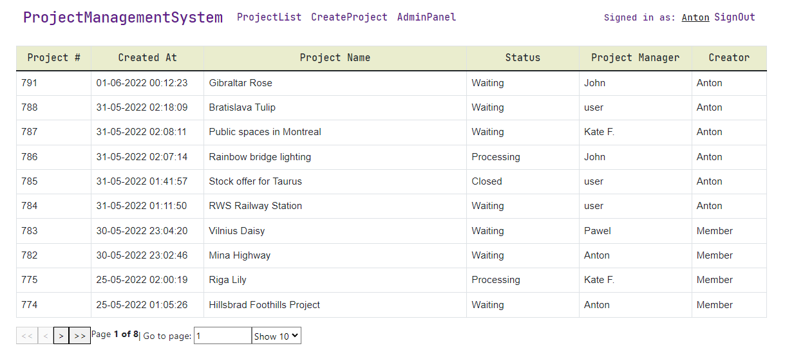
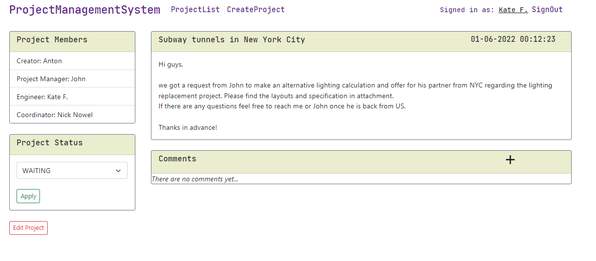
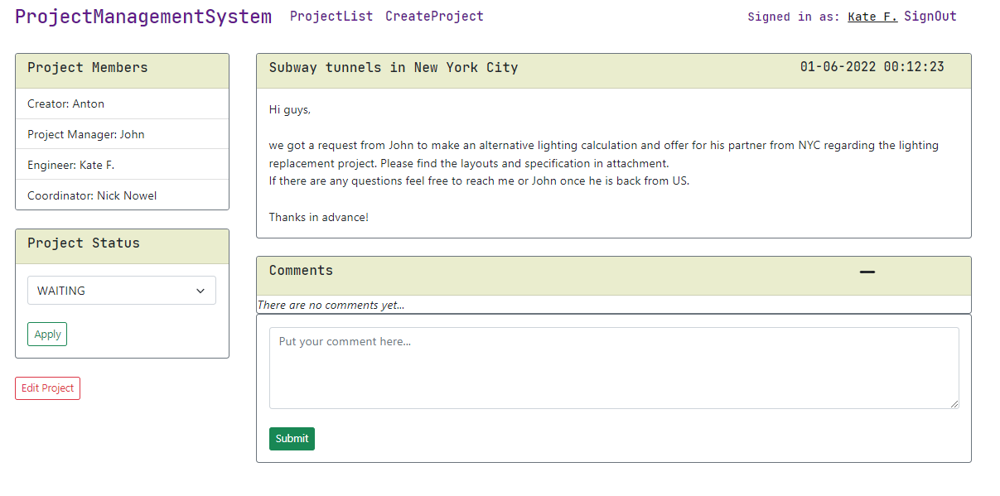
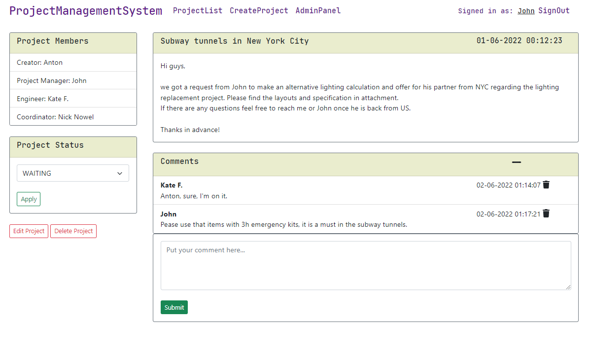
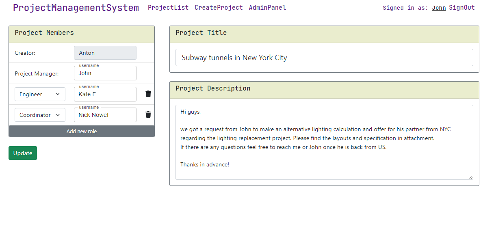
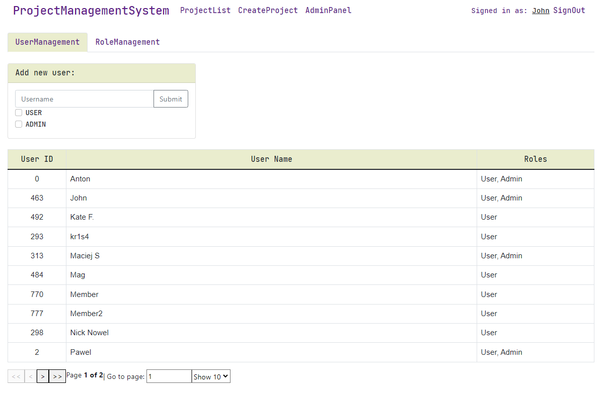
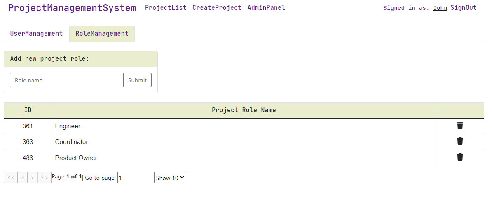
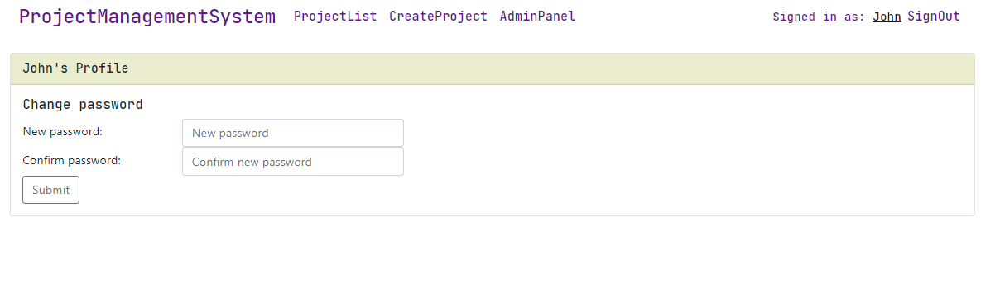
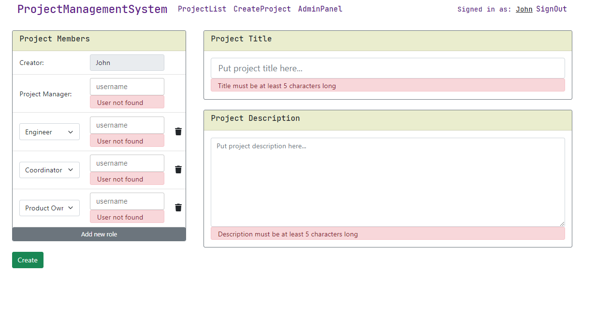

# Project Management System - UI (pms-ui)
> This is UI part of the [Project Management System](#https://github.com/stormx86/pms-rest-services) application.
> Application provides basic functionality for performing management actions on the projects(in a general understanding) via web interface.
> Previously existed FE part has been removed from [pms-rest-services](#https://github.com/stormx86/pms-rest-services), and the 
> current UI module was implemented with React from scratch.
 
 ## Table of contents
 * [General info](#general-info)
 * [Screenshots](#screenshots)
 * [Technologies](#technologies)
 * [Features](#features)
 * [Status](#status)
 * [Contact](#contact)
 
 ## General info
This is my firs full-functional application in React created from scratch.
React is my secondary skill since at my current position I'm BE Java engineer and touching the FE part in a limited scope, 
but I believe there is no limits for curiosity and self-improvement.
This UI module consumes the API provided by [pms-rest-services](#https://github.com/stormx86/pms-rest-services)
 
 ## Screenshots
 
 
 
 
 
 
 
 
 
 
 
 ## Technologies
 
 * React 16
 * React-router-dom 5
 * React-validation 3.0.7
 * Axios
 * Material UI
 * Bootstrap
 * Fontawesome
 
 ## Features
 List of features ready
 * Authentication & authorization system with JWT
 * The main screen is a table with a list of projects
 * Initially the project creator designates the project roles, which can be changed later by any project member 
 * USER has access (see on the list and can open the details) to the project only if he is a member of the particular project
 * Project name, description and Project Manager's name are required at the creation stage
 * Only a user who actually exists in the database can be added to the project
 * Bean validation at the BE side
 * Autocomplete for the username inputs
 * The following statuses for the project available: - "Waiting", "Processing" and "Closed"
 * USERs can leave comments
 * Two global roles: USER, ADMIN
 * USER's permissions: browse projects list(only projects where user is a member); create/read/update projects; change project status; leave comments on the project; change password via User Profile
 * ADMIN's permissions: all USERs permissions + browse all projects (regardless whether he is a member or not); delete projects; delete comments; create/update/edit user; change user's permissions; reset user's password; create/delete project roles
 
 To-do list:
 * Filtering by project name
 * Attaching files to the project
 * Response to a specific comment
 * Subtasks on the project
 * Logging actions on the project
 * Create/delete/edit project statuses via Admin Panel
 
 ## Status
 Project is: _in progress_
 
 ## Contact
 Created by Anton Kozhanov [deal.for at gmail.com]